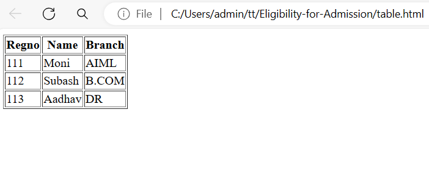

# EX01 Developing a Simple Webserver
## Date:
28.03.2024

## AIM:
To develop a simple webserver to serve html pages.

## DESIGN STEPS:
### Step 1: 
HTML content creation.

### Step 2:
Design of webserver workflow.

### Step 3:
Implementation using Python code.

### Step 4:
Serving the HTML pages.

### Step 5:
Testing the webserver.

## PROGRAM:
~~~
<!DOCTYPE html>
<html lang="en">
<head>
    <meta charset="UTF-8">
    <meta name="viewport" content="width=device-width, initial-scale=1.0">
    <title>Document</title>
</head>
<body>
    <table border>
        <tr>
            <th>Regno</th>
            <th>Name</th>
            <th>Branch</th>
        </tr>
        <tr>
            <td>111</td>
            <td>Moni</td>
            <td>AIML</td>
        </tr>
        <tr>
            <td>112</td>
            <td>Subash</td>
            <td>B.COM</td>
        </tr>
        <tr>
            <td>113</td>
            <td>Aadhav</td>
            <td>DR</td>
        </tr>
    </table>
</body>
</html>
~~~
## OUTPUT:

## RESULT:
The program for implementing simple webserver is executed successfully.
